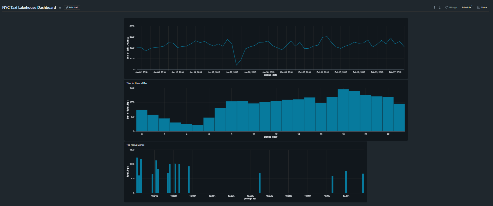

# NYC Taxi Lakehouse — End-to-End Batch ELT Pipeline

An end-to-end batch data engineering pipeline built on **Databricks**, processing NYC taxi trip data through a **bronze → silver → gold medallion architecture**, orchestrated as a scheduled multi-task job, and served through an interactive dashboard.

This project demonstrates a complete, production-style data engineering workflow: ingestion, cleaning, aggregation, orchestration, scheduling, and visualization.

---

## Architecture

Source Data → Bronze (raw) → Silver (cleaned) → Gold (aggregated) → Dashboard

- **Bronze** → raw data stored as-received (Delta)
- **Silver** → validated and cleaned data (Delta)
- **Gold** → business-ready aggregated metrics (Delta)

Orchestrated by Databricks Jobs and scheduled to run daily.

| Layer | Purpose | Output |
|-------|---------|--------|
| **Bronze** | Ingest raw source data, stored exactly as received | `bronze_trips` |
| **Silver** | Clean: remove invalid/duplicate rows, enforce types, add derived columns | `silver_trips` |
| **Gold** | Aggregate into business-ready metrics | `gold_daily_summary`, `gold_hourly_demand`, `gold_top_pickup_zones` |

---

## Tech Stack

- **Compute & Processing:** Apache Spark (PySpark)
- **Storage Format:** Delta Lake (ACID transactions, schema enforcement, time travel)
- **Platform:** Databricks (Free Edition, serverless)
- **Orchestration:** Databricks Jobs (multi-task DAG with dependencies, daily schedule)
- **Modeling Pattern:** Medallion architecture (bronze / silver / gold)
- **Visualization:** Databricks SQL Dashboards
- **Language:** Python, SQL

---

## Pipeline Overview

### 1. Bronze — Ingestion (`01_bronze_ingestion.ipynb`)
Reads the source NYC taxi dataset and writes it to a Delta table unchanged. The write is **idempotent** (`overwrite` mode), so the step can be re-run safely. Bronze preserves the raw source of truth.

### 2. Silver — Cleaning (`02_silver_cleaning.ipynb`)
Profiles data quality, then removes invalid records (non-positive distance/fare, null timestamps) and duplicates, and adds derived columns (`trip_duration_min`, `pickup_date`, `pickup_hour`). About 0.4% of rows were filtered as invalid. Silver is the trusted, analysis-ready layer.

### 3. Gold — Analytics (`03_gold_analytics.ipynb`)
Builds three aggregated tables answering specific business questions:
- **Daily summary** — revenue, trip count, and averages per day
- **Hourly demand** — trip volume by hour of day
- **Top pickup zones** — busiest pickup locations by trip count

### 4. Orchestration & Scheduling
The three notebooks are chained into a single **Databricks Job** as a DAG: bronze → silver → gold, with task dependencies so each stage runs only after the previous one succeeds. The job is **scheduled to run daily**, making the pipeline fully automated.

### 5. Dashboard
An interactive dashboard built on the gold tables, visualizing daily revenue trends, hourly demand patterns, and top pickup zones.

---

## Key Concepts Demonstrated

- Medallion (bronze/silver/gold) lakehouse architecture
- Delta Lake table management and idempotent writes
- Data quality profiling before cleaning
- Dimensions vs. measures in aggregation and visualization
- Multi-task job orchestration with dependencies (DAG)
- Scheduled, automated pipeline execution

---

## Repository Structure

- `01_bronze_ingestion.ipynb` — Raw ingestion → bronze Delta table
- `02_silver_cleaning.ipynb` — Cleaning & enrichment → silver Delta table
- `03_gold_analytics.ipynb` — Aggregations → gold Delta tables
- `dashboard.png` — Published dashboard screenshot
- `README.md`

---

## Author

**Nagendra Reddy Bonamukkala**

[GitHub](https://github.com/Nagendra191220) · [LinkedIn](https://www.linkedin.com/in/nagendra-reddy-bonamukkala-5b8805224)
